# Cloud Mid Frontend

## Rationale behind Selection of Serverless Architecture

This application was selected to be serverless due to the following reasons:

1. **Cost Effectiveness**: I only pay what I utilize- no additional funds onto idleness.
2. **Automatic Scaling**: It manages the automatic scaling and I do not need to adjust anything.
3. **Less Operational Overhead**: No servers to watch over or maintain, big time saved.
4. **Quick Deployment**: I am able to iterate and release new updates very fast.
5. **High Availability**: AWS region-based built-in redundancy maintains the smooth running of the app.

## The IAM Protection of Lambda Execution

The IAM configuration is based on the least privilege principle:

**Lambda Implementation Role** (`lambda-implementation-role`):
- Only makes CloudWatch logs-nothing more.
- No connection to any other AWS service, and things are kept clean.
- Limited permissions result in minimal attack surface.

**User Policy** (`cloud-mid-user`):
- Only send the permissions that are necessary to the AWS services.
- None of the wildcard permissions (`*`) is allowed, it is all specific.
- Distinct separation of what is required to be deployed and what is required to be executed.

## How Automatic Scaling Works

AWS Lambda is automatically scaled on:

- **Forced Requests**: Each request creates a container.
- **Burst Capacity**: Scaling at a moment of high traffic sudden increase.
- **Memory Allocation**: Memory scaling with Compute power.
- **No Opinionated**: Scaling is fully automatic and non-opaque.

## What Would It Take to Change of Production

In order to deploy production, the following changes would be needed:

1. **API Security**:
   - Add API keys and usage plans.
   - Add Cognito authentication as an additional security.
   - Install request validation and throttling to manage safe traffic.

2. **Monitoring & Alerting**:
   - Produce CloudWatch error rate alarms.
   - Include additional measures to gain a better understanding.
   - X-Ray Deploy distributed tracing to monitor request flows.

3. **Environment Management**:
   - Individual development, testing, and production.
   - Adjust environment-specific settings.
   - Apply blue/green implementation plans in order to reduce downtimes.

4. **Data Persistence**:
   - Add DynamoDB to store event information.
   - Install data retention policies.
   - Establish contingency and recovery processes in order to protect information.

5. **Performance Optimization**:
   - Tune Lambda operates in memory settings.
   - Put measures to alleviate cold starts.

## Screenshots

### Architecture Diagram

**Figure 1: System Architecture Overview**
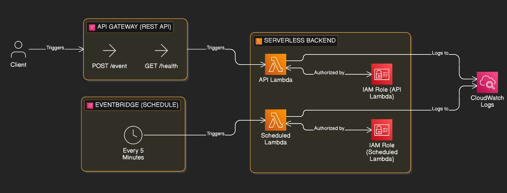

### IAM Configuration

**Figure 2: IAM User - cloud-mid-user**
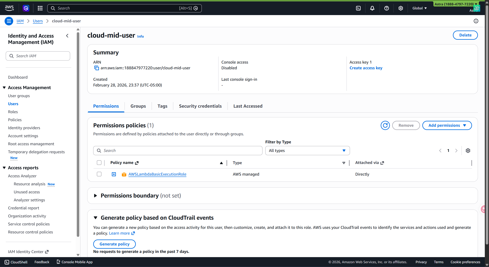

**Figure 3: Custom IAM Policy Attached to User**
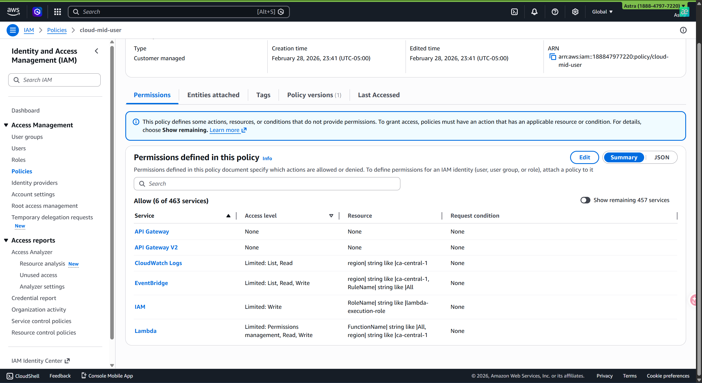

**Figure 4: Lambda Execution Role with Trust Policy**
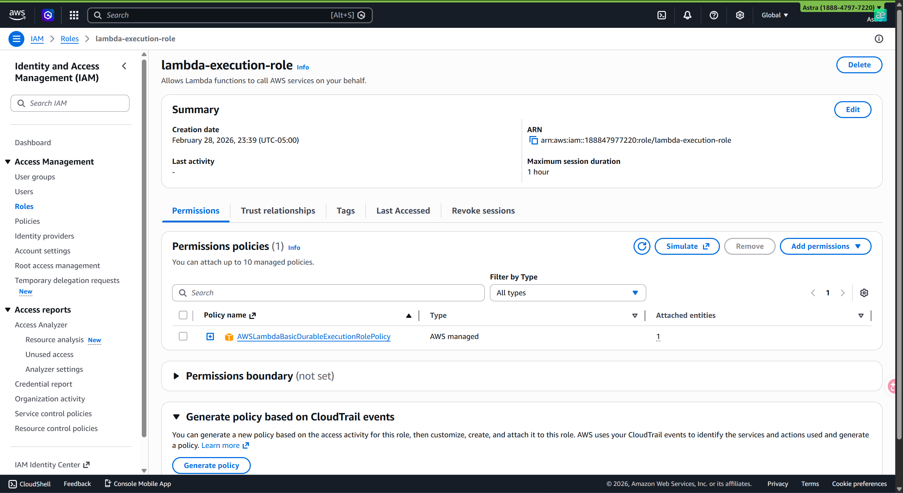

### Lambda Functions

**Figure 5: Health API Lambda Function Configuration**
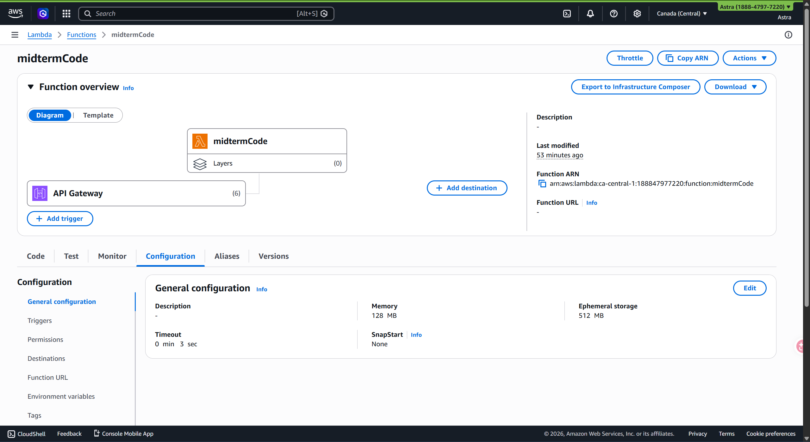

**Figure 6: Heartbeat Lambda Function Configuration**
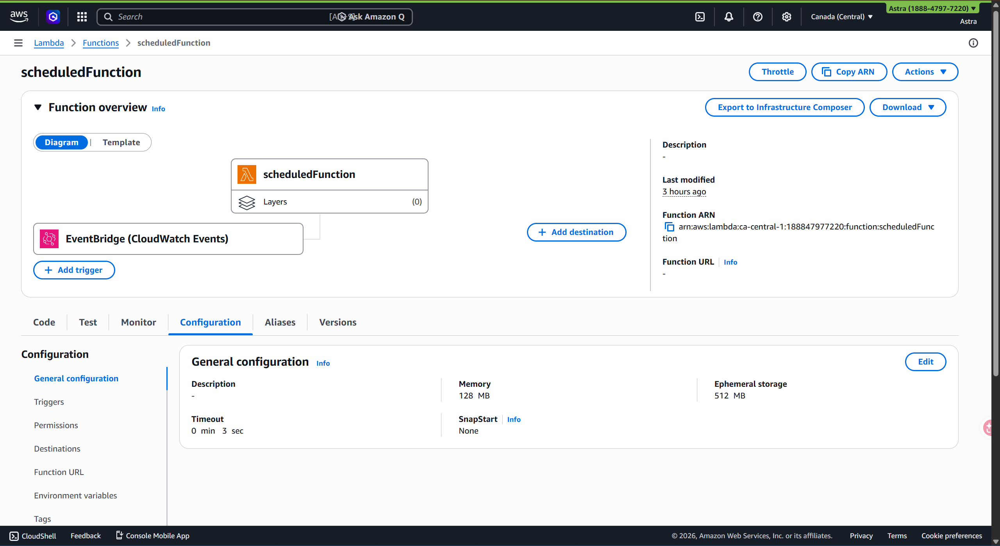

**Figure 7: CloudWatch Logs for Lambda Executions**
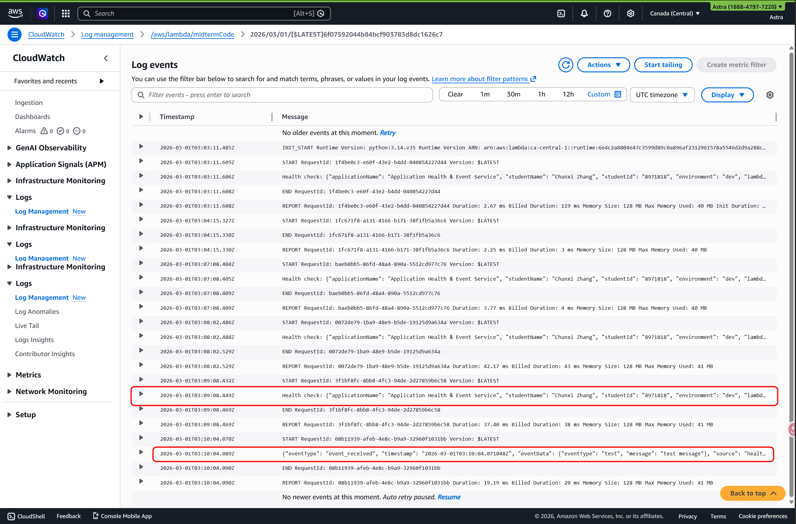

### API Gateway

**Figure 8: API Gateway Resources (/health and /event)**
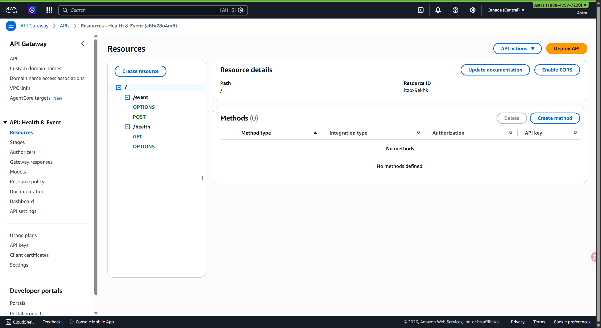

**Figure 9: API Gateway Deployment Stage**
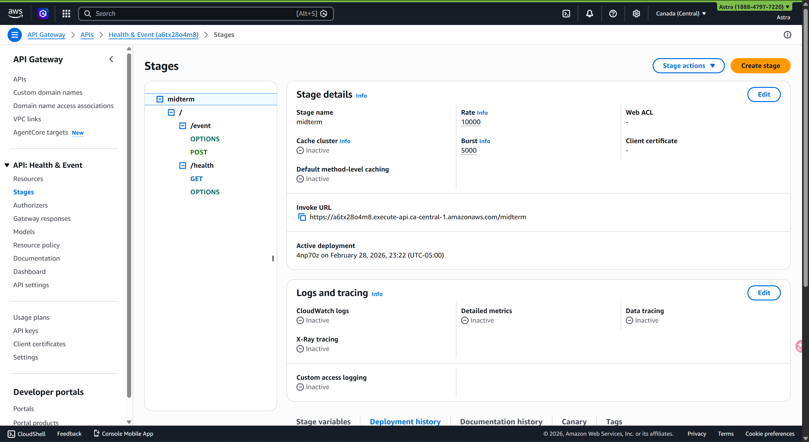

### EventBridge

**Figure 10: EventBridge Scheduled Rule (rate 5 minutes)**
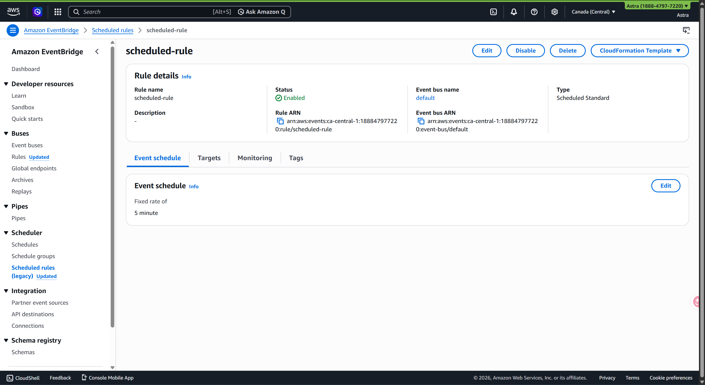

**Figure 11: EventBridge Rule Targets**
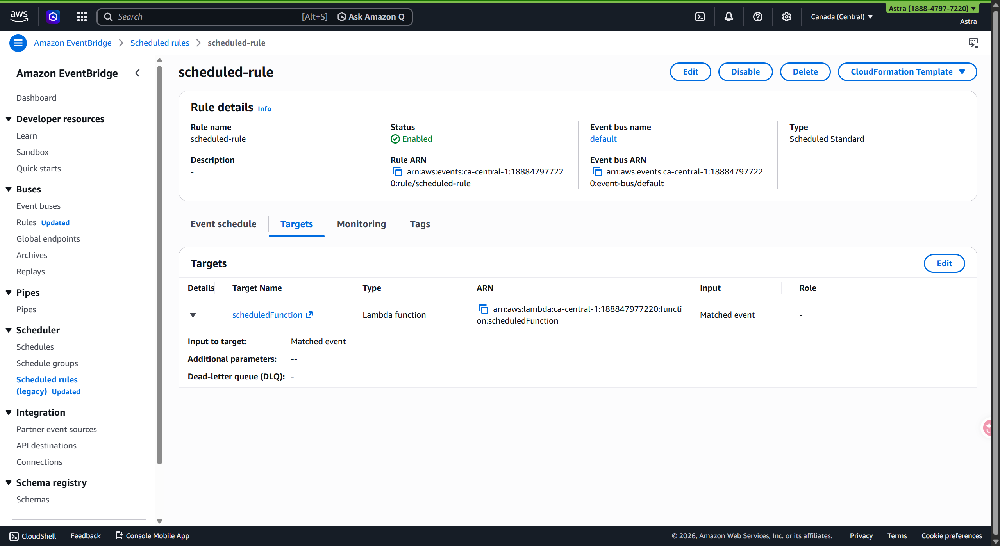

### Frontend Application

**Figure 12: AWS Amplify Deployment**
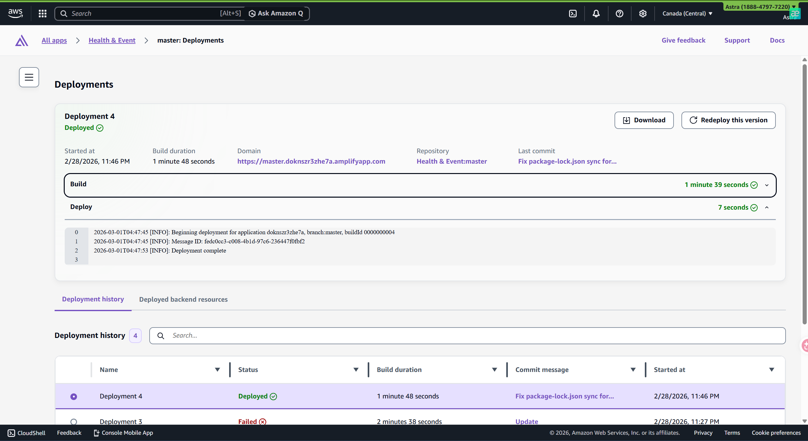

**Figure 13: Full Application Dashboard**
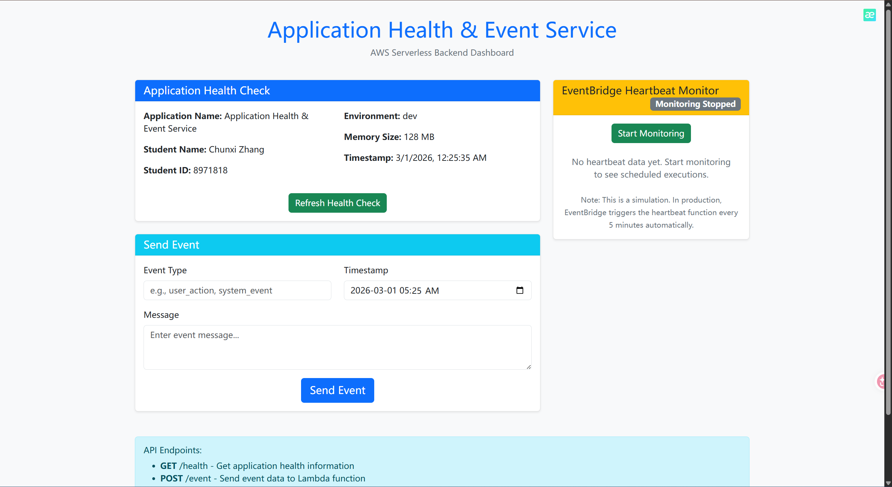

**Figure 14: Event Submission Form**
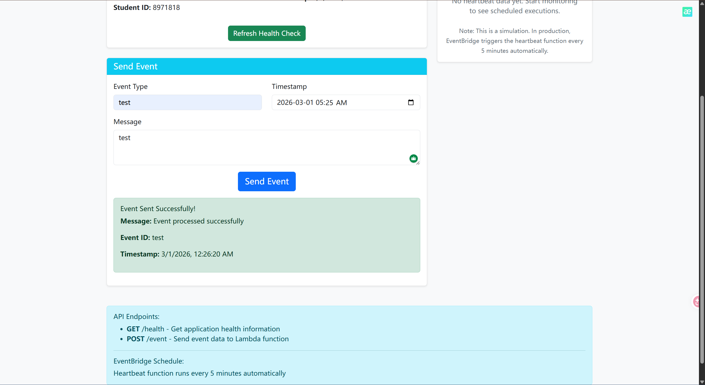

**Figure 15: Heartbeat Monitor Component**
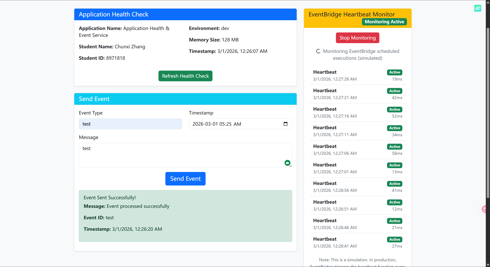

### Testing

**Figure 16: Health Endpoint API Test**
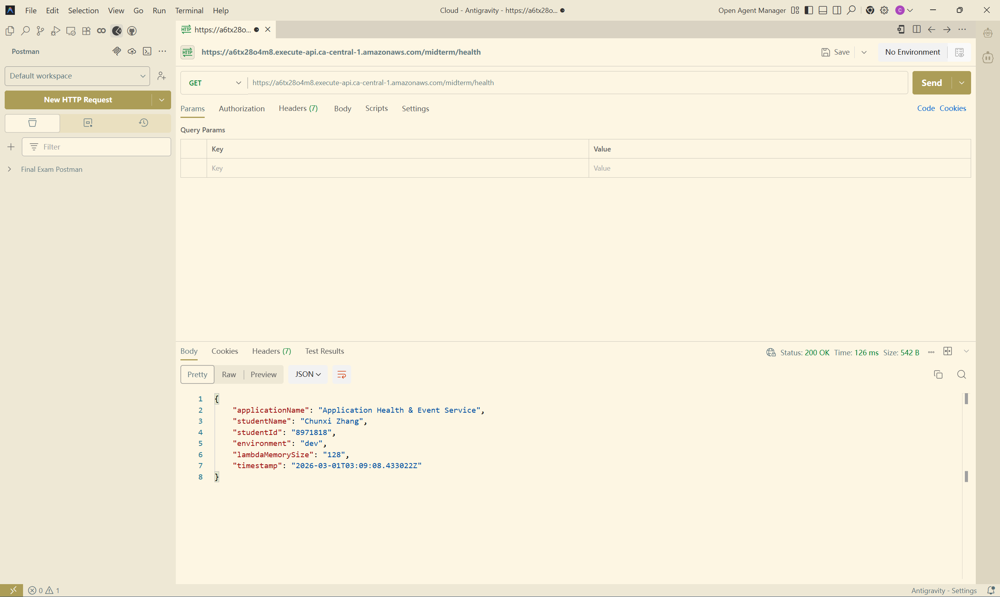

**Figure 17: Event Endpoint API Test**
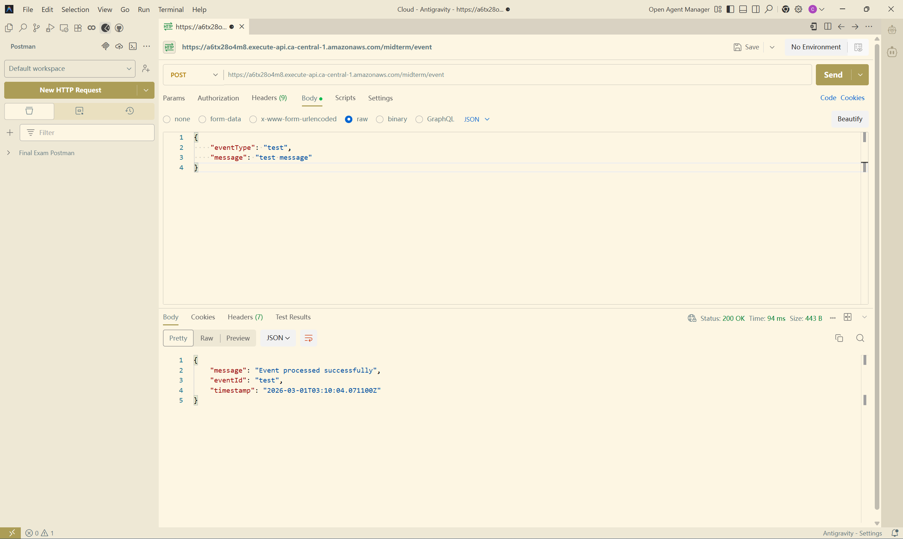
